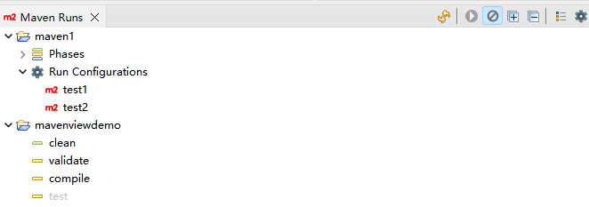
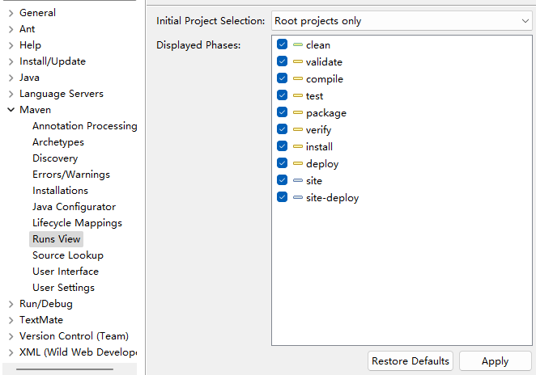

# Eclipse Maven View

A plug-in that recreates IntelliJ IDEA's Maven View for Eclipse.

Now Support Eclipse 2024-06 and later, Mac OS X, Linux (with nautilus) and Windows.

## Use

Open the Maven View within Eclipse via `Window` > `Show View` > `Maven` and search for **Maven Runs**.



Customize settings according to your preference in Eclipse Preferences Settings.



## History
Fork of [eclipse-maven-view](https://github.com/slothsoft/eclipse-maven-view) on Github. Over time, I have added several improvements and new features, including:

- Full support for Eclipse 2024-06 and later releases.
- Added `ExpandAll`, `CollapseAll`, `SkipTests`, and `Open maven Settings preferences` commands.
- Optimize `Run` command conditions and styles.
- Add view refresh on Project Creation / Renaming / Deletion

## Build

This project uses [Tycho](https://github.com/eclipse-tycho/tycho) with [Maven](https://maven.apache.org/) to build. It requires Maven 3.9.0 or higher version.

Dev build:

```
mvn clean verify
```

Release build:

```
mvn clean org.eclipse.tycho:tycho-versions-plugin:set-version -DnewVersion=2.0.0 verify
```

## Install

1. Add `https://raw.githubusercontent.com/tlcsdm/eclipse-maven-view/master/update_site/` as the upgrade location in Eclipse.
2. Download from [Jenkins](https://jenkins.tlcsdm.com/job/eclipse-plugin/job/eclipse-maven-view)
3. <table style="border: none;">
  <tbody>
    <tr style="border:none;">
      <td style="vertical-align: middle; padding-top: 10px; border: none;">
        <a href='http://marketplace.eclipse.org/marketplace-client-intro?mpc_install=7232495' title='Drag and drop into a running Eclipse Indigo workspace to install eclipse-maven-view'> 
          
        </a>
      </td>
      <td style="vertical-align: middle; text-align: left; border: none;">
        ← Drag it to your eclipse workbench to install! (I recommand Main Toolbar as Drop Target)
      </td>
    </tr>
  </tbody>

</table>

